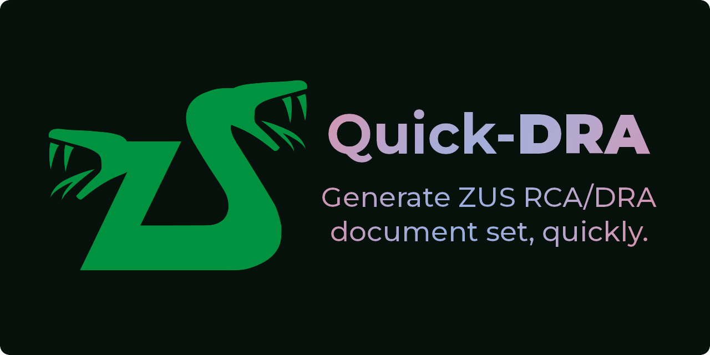

# Quick DRA




Quick-DRA (rhymes with _hydra_) allows generating simple ZUS RCA/DRA document
sets for help hired directly by natural persons (one w/out REGON) to be able
to fullfil the insurance obligations.

## Usage

### Configuration

#### Add payer

```plain
> qdra payer \
    --first Jan \
    --last Nowak \
    --social-id 26211012346 \
    --tax-id 7680002466 \
    --id-card ABC523456 \
    -y
Quick-DRA: file ~/.quick_dra.yaml will be created as needed.
First name changed from <empty> to Jan
Last name changed from <empty> to Nowak
NIP changed from <empty> to 7680002466
PESEL changed from <empty> to 26211012346
Document kind changed from <empty> to 1
Document changed from <empty> to ABC523456
```

#### Add insured

_Still to be done._

```plain
> qdra insured add \
    --first Jan \
    --last Nowak \
    --insurance-title "0110 0 0" \
    --social-id 26211012346 \
    --???
????
```

### Prepare ZUD RCA/DRA

Generate RCA/DRA xml file for last month

```plain
> qdra xml
-- report: #1 2026-01
-- output: quick-dra_202601-01.xml
```
