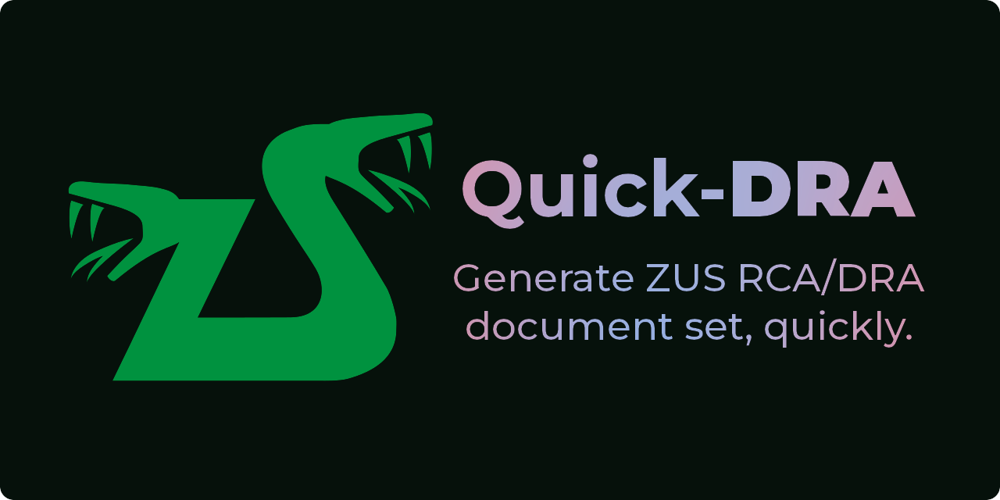
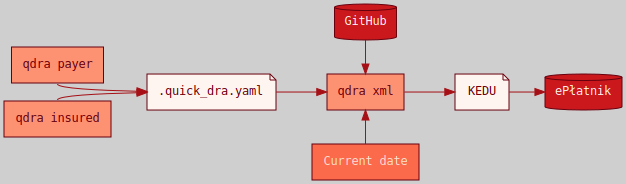

# Quick DRA

Quick-DRA (rhymes with _hydra_) allows generating simple ZUS RCA/DRA document sets for help hired directly by natural persons (one w/out REGON) to be able to fullfil the insurance obligations.

The CLI tool aids with configuration of both insurance payer and insured people. This data, along with insurance details and configuration is used to generate KEDU report, uploadable to ZUS platform ePłatnik. Insurance configuration is present in every installation, with backup downloadable from this repo, so that every installation is future-proofed against acts and regulations.

## See Also

- [Usage](docs/usage.md)
- [Building](docs/building.md)
- [Roadmap](docs/roadmap.md)

## SAST Tools

[PVS-Studio](https://pvs-studio.com/en/pvs-studio/?utm_source=website&utm_medium=github&utm_campaign=open_source) - static analyzer for C, C++, C#, and Java code.
